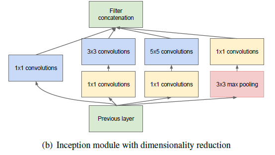

# What should we do to find an ideal job as a deep learning engineer
# 1.Relevant Books
- [ ] 李航 **"统计学习方法"**
- [ ] 周志华 **"机器学习"**
- [ ] 何海涛 **"剑指offer"**
- [ ] 诸葛越 **"百面机器学习"**
- [ ] scutan90 **"DeepLearning-500-questions"** https://github.com/scutan90/DeepLearning-500-questions
- [ ] Stephen Prata **"C++ Primer Plus"**
- [ ] **"数据结构"**
- [ ] Ian Goodfellow [**"深度学习"**](https://exacity.github.io/deeplearningbook-chinese/)

# 2.Best Papers

## Classical Network Structures

##### 2012
- [x] AlexNet [**"Imagenet classification with deep convolutional neural networks"**](#AlexNet)
##### 2014
- [x] VGGNet [**"Very deep convolutional networks for large-scale image recognition"**](#VGGNet)
- [x] Network in Network [**"Network In Network"**](#NIN)
##### 2015
- [x] GoogLeNet [**"Going deeper with convolutions"**](#GoogLeNet)
- [x] ResNet **"Deep residual learning for image recognition"**
- [ ] Inception-v3 **"Rethinking the Inception Architecture for Computer Vision"**
##### 2016
- [x] Inception-v4 [**"Inception-v4, Inception-ResNet and the Impact of Residual Connections on Learning"**](#Inception-v4)
- [ ] Attention **"Show, Attend and Tell Neural Image Caption Generation with Visual Attention"**
##### 2017
- [ ] Xception **"Xception: Deep Learning with Depthwise Separable Convolutions"**
- [x] MobileNet [**"MobileNets: Efficient Convolutional Neural Networks for Mobile Vision Applications"**](#MobileNet)
- [ ] ResNeXt **"Aggregated Residual Transformations for Deep Neural Networks"**
##### 2018
- [x] DenseNet **"Densely Connected Convolutional Networks"**
- [x] MobileNetV2 [**"MobileNetV2: Inverted Residuals and Linear Bottlenecks"**](#MobileNetV2)
- [ ] NASNet **"Learning Transferable Architectures for Scalable Image Recognition"**

## Models

##### 2014
- [ ] DropOut **"Dropout: a simple way to prevent neural networks from overfitting"**
##### 2015
- [ ] BatchNorm **"Batch normalization: Accelerating deep network training by reducing internal covariate shift"**
- [ ] Net2Net **"Net2net: Accelerating learning via knowledge transfer"**

## Efficient Computation
##### 2015
- [ ] Deep Compression **"Deep compression: Compressing deep neural network with pruning, trained quantization and huffman coding"**
##### 2016
- [ ] SqueezeNet **"SqueezeNet: AlexNet-level accuracy with 50x fewer parameters and <0.5MB model size"**
##### 2017
- [ ] Survey **"A Survey of Model Compression and Acceleration for Deep Neural Networks"**
- [ ] ShuffleNet **"ShuffleNet: An Extremely Efficient Convolutional Neural Network for Mobile Devices"**
##### 2018
- [ ] Survey **"Recent Advances in Efficient Computation of Deep Convolutional Neural Networks"**

## Optimization

##### 2013
- [ ] Momentum **"On the importance of initialization and momentum in deep learning"**
##### 2014
- [ ] Adam **"Adam: A method for stochastic optimization"**
##### 2016
- [ ] Neural Optimizer **"Learning to learn by gradient descent by gradient descent"**

## Object Detection

##### 2014
- [ ] RCNN **"Rich feature hierarchies for accurate object detection and semantic segmentation"**
- [ ] SPPNet **"Spatial pyramid pooling in deep convolutional networks for visual recognition"**
##### 2015
- [ ] Faster R-CNN **"Faster R-CNN: Towards real-time object detection with region proposal networks"**
- [ ] YOLO **"You only look once: Unified, real-time object detection"**
##### 2016
- [ ] R-FCN **"R-FCN: Object Detection via Region-based Fully Convolutional Networks"**
##### 2017
- [ ] **"Mask R-CNN"**

## Deep Generative Model

##### 2013
- [ ] VAE **"Auto-encoding variational bayes"**
##### 2014
- [ ] GAN **"Generative adversarial nets"**
##### 2015
- [ ] VAE with attention **"DRAW: A recurrent neural network for image generation"**

## RNN

## Deep Reinforcement Learning

##### 2015
- [ ] **"Human-level control through deep reinforcement learning"**
##### 2016
- [ ] **"Asynchronous methods for deep reinforcement learning"**
- [ ] AlphaGo **"Mastering the game of Go with deep neural networks and tree search"**

## Deep Transfer Learning

---------------------------
# 3.Papers Summaries
## Classical Network Structures

### AlexNet 

**"Imagenet classification with deep convolutional neural networks"**(https://papers.nips.cc/paper/4824-imagenet-classification-with-deep-convolutional-neural-networks.pdf)

### VGGNet 
[**"Very deep convolutional networks for large-scale image recognition"**](https://arxiv.org/pdf/1409.1556.pdf)

[Review](https://medium.com/coinmonks/paper-review-of-vggnet-1st-runner-up-of-ilsvlc-2014-image-classification-d02355543a11)

1. The use of stack 3×3 filters is effient than of 5×5 or 7×7 filters
2. A deep net with small filters outperforms a shallow net with larger filters
3. Combining the outputs of several models by averaging their soft-max class posteriors improves the performance due to complementarity of the models

### NIN
[**"Network In Network"**](https://arxiv.org/abs/1312.4400)

[Review](https://towardsdatascience.com/review-nin-network-in-network-image-classification-69e271e499ee)

1. Proposed a new network structure--mlpconv layer

  

2. Usually, fully connected layers are used at the end of network, however, they are prone to overfitting. This article used global average pooling layer as the last layer of the network, it is more native to the convolution structure by enforcing correspondences between feature maps and categories, and could prevent over-fitting.

### GoogLeNet 

[**"Going deeper with convolutions"**](https://www.cs.unc.edu/~wliu/papers/GoogLeNet.pdf)

[Review](https://medium.com/coinmonks/paper-review-of-googlenet-inception-v1-winner-of-ilsvlc-2014-image-classification-c2b3565a64e7)

1. 1×1 convolution is used as a dimension reduction module to reduce the computation. By reducing the computation bottleneck, depth and width can be increased
2. When image’s coming in, different sizes of convolutions as well as max pooling are tried. Then different kinds of features are extracted.
3. Global average pooling is used nearly at the end of network by averaging each feature map from 7×7 to 1×1, and authors found that a move from FC layers to average pooling improved the top-1 accuracy by about 0.6%.
4. Auxiliary classifiers for combating gradient vanishing problem, also providing regularization.
5. besides the network design, the other stuffs like ensemble methods, multi-scale and multi-crop approaches are also essential to reduce the error rate

### MobileNet
[**"MobileNets: Efficient Convolutional Neural Networks for Mobile Vision Applications"**](https://arxiv.org/abs/1704.04861)

[Review](https://towardsdatascience.com/review-mobilenetv1-depthwise-separable-convolution-light-weight-model-a382df364b69)

1.

### MobileNetV2
[**"MobileNetV2: Inverted Residuals and Linear Bottlenecks"**](https://arxiv.org/abs/1801.04381)

[Review](https://towardsdatascience.com/review-mobilenetv2-light-weight-model-image-classification-8febb490e61c)

### Inception-v4

提出了一种新的inception模型，并提出了一种inception与residual connection结合的模型
