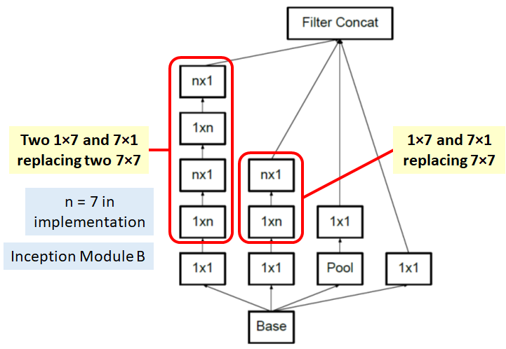
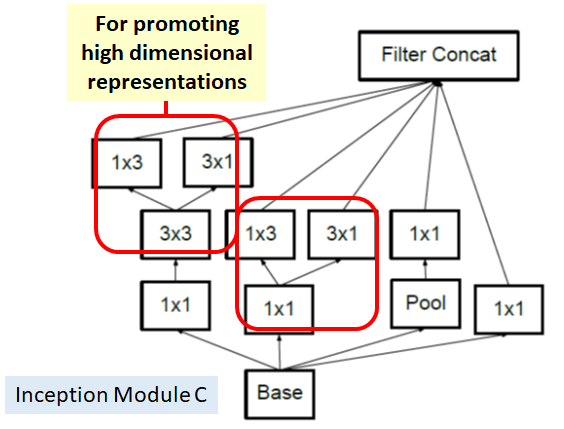
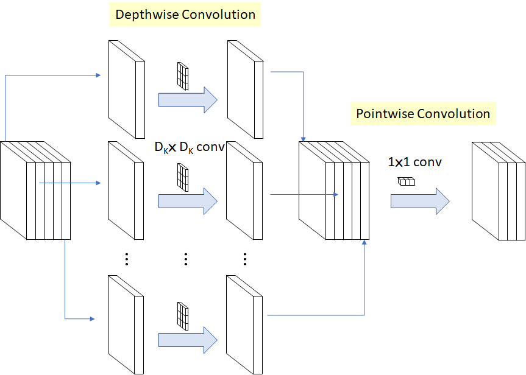
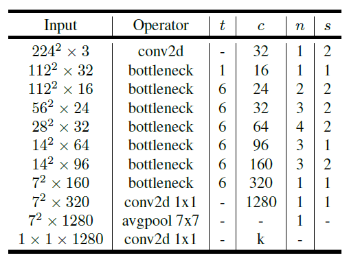
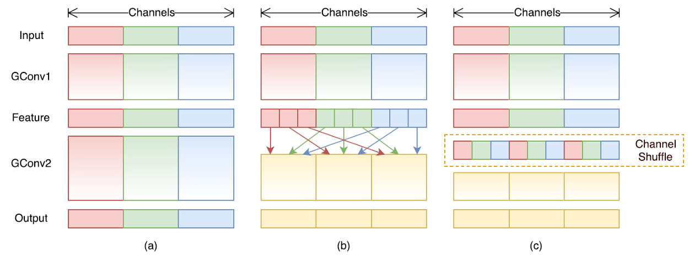
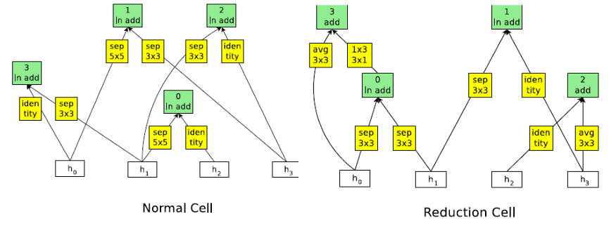

# What should we do to find an ideal job as a deep learning engineer

# Content

[1. Books](#1books)

[2. Papers](#2papers)

[3. Concept Explanation](#3concept-explanation)

# 1.Books
- [ ] 李航 **"统计学习方法"**
- [ ] 周志华 **"机器学习"**
- [ ] 何海涛 **"剑指offer"**
- [ ] 诸葛越 **"百面机器学习"**
- [ ] scutan90 **"DeepLearning-500-questions"** https://github.com/scutan90/DeepLearning-500-questions
- [ ] Stephen Prata **"C++ Primer Plus"**
- [ ] **"数据结构"**
- [ ] Ian Goodfellow [**"深度学习"**](https://exacity.github.io/deeplearningbook-chinese/)

# 2.Papers

## Image Classification

##### 2012
- [x] AlexNet [**"Imagenet classification with deep convolutional neural networks"**](#AlexNet)
##### 2014
- [x] VGGNet [**"Very deep convolutional networks for large-scale image recognition"**](#VGGNet)
- [x] Network in Network [**"Network In Network"**](#NIN)
##### 2015
- [x] GoogLeNet [**"Going deeper with convolutions"**](#GoogLeNet)
- [ ] ResNet **"Deep residual learning for image recognition"**
- [x] Inception-v3 [**"Rethinking the Inception Architecture for Computer Vision"**](#InceptionV3)
##### 2016
- [x] Inception-v4 [**"Inception-v4, Inception-ResNet and the Impact of Residual Connections on Learning"**](#Inception-v4)
- [ ] Attention **"Show, Attend and Tell Neural Image Caption Generation with Visual Attention"**
- [ ] SqueezeNet **"SqueezeNet: AlexNet-level accuracy with 50x fewer parameters and <0.5MB model size"**
##### 2017
- [ ] Xception **"Xception: Deep Learning with Depthwise Separable Convolutions"**
- [x] MobileNet [**"MobileNets: Efficient Convolutional Neural Networks for Mobile Vision Applications"**](#MobileNet)
- [ ] ResNeXt **"Aggregated Residual Transformations for Deep Neural Networks"**
- [x] ShuffleNet [**"ShuffleNet: An Extremely Efficient Convolutional Neural Network for Mobile Devices"**](#shufflenet)
- [ ] CondenseNet **"CondenseNet: An Efficient DenseNet using Learned Group Convolutions"**
##### 2018
- [ ] DenseNet **"Densely Connected Convolutional Networks"**
- [x] MobileNetV2 [**"MobileNetV2: Inverted Residuals and Linear Bottlenecks"**](#MobileNetV2)
- [ ] NASNet [**"Learning Transferable Architectures for Scalable Image Recognition"**](#NasNet)
- [ ] ShuffleNetV2 [**"ShuffleNet V2: Practical Guidelines for Efficient CNN Architecture Design"**](#shufflenetv2)

##### 2019

- [ ] MobileNetV3 [**"Searching for MobileNetV3"**](#MobileNetV3)
- [ ] MnasNet [**"MnasNet: Platform-Aware Neural Architecture Search for Mobile"**](#MnasNet)

## Models

##### 2014
- [ ] DropOut **"Dropout: a simple way to prevent neural networks from overfitting"**
##### 2015
- [x] BatchNorm [**"Batch normalization: Accelerating deep network training by reducing internal covariate shift"**](#BatchNorm)
- [ ] Net2Net **"Net2net: Accelerating learning via knowledge transfer"**

## Compact Network Design

##### 2016

- [ ] SqueezeNet **"SqueezeNet: AlexNet-level accuracy with 50x fewer parameters and <0.5MB model size"**

##### 2017

- [ ] Xception **"Xception: Deep Learning with Depthwise Separable Convolutions"**
- [ ] MobileNet [**"MobileNets: Efficient Convolutional Neural Networks for Mobile Vision Applications"**](#MobileNet)
- [ ] ResNeXt **"Aggregated Residual Transformations for Deep Neural Networks"**
- [x] ShuffleNet [**"ShuffleNet: An Extremely Efficient Convolutional Neural Network for Mobile Devices"**](#shufflenet)
- [ ] CondenseNet **"CondenseNet: An Efficient DenseNet using Learned Group Convolutions"**

##### 2018

- [ ] MobileNetV2 [**"MobileNetV2: Inverted Residuals and Linear Bottlenecks"**](#MobileNetV2)
- [ ] ShuffleNetV2 [**"ShuffleNet V2: Practical Guidelines for Efficient CNN Architecture Design"**](#shufflenetv2)

##### 

## Neural Architecture Search

##### 2016

- [ ] Nas **Neural Architecture Search with Reinforcement Learning**

##### 2018

- [ ] NASNet [**"Learning Transferable Architectures for Scalable Image Recognition"**](#NasNet)

##### 2019

- [ ] MobileNetV3 [**"Searching for MobileNetV3"**](#MobileNetV3)
- [ ] MnasNet [**"MnasNet: Platform-Aware Neural Architecture Search for Mobile"**](#MnasNet)

## Efficient Computation
##### 2015
- [ ] Deep Compression **"Deep compression: Compressing deep neural network with pruning, trained quantization and huffman coding"**
##### 2017
- [x] Survey [**"A Survey of Model Compression and Acceleration for Deep Neural Networks"**](#model-compression)
##### 2018

- [ ] Survey **"Recent Advances in Efficient Computation of Deep Convolutional Neural Networks"**

### Pruning

### Quantization

### Knowledge Distillation

## Optimization

##### 2013
- [ ] Momentum **"On the importance of initialization and momentum in deep learning"**
##### 2014
- [ ] Adam **"Adam: A method for stochastic optimization"**
##### 2016
- [ ] Neural Optimizer **"Learning to learn by gradient descent by gradient descent"**

## Object Detection

##### 2014
- [ ] RCNN **"Rich feature hierarchies for accurate object detection and semantic segmentation"**
- [ ] SPPNet **"Spatial pyramid pooling in deep convolutional networks for visual recognition"**
##### 2015
- [ ] Faster R-CNN **"Faster R-CNN: Towards real-time object detection with region proposal networks"**
- [ ] YOLO **"You only look once: Unified, real-time object detection"**
##### 2016
- [ ] R-FCN **"R-FCN: Object Detection via Region-based Fully Convolutional Networks"**
##### 2017
- [ ] **"Mask R-CNN"**

## Deep Generative Model

##### 2013
- [ ] VAE **"Auto-encoding variational bayes"**
##### 2014
- [ ] GAN **"Generative adversarial nets"**
##### 2015
- [ ] VAE with attention **"DRAW: A recurrent neural network for image generation"**


## Deep Reinforcement Learning

##### 2013

- [ ] **"Playing atari with deep reinforcement learning"**

##### 2015

- [ ] **"Human-level control through deep reinforcement learning"**
- [ ] **"Continuous control with deep reinforcement learning"**
##### 2016
- [ ] **"Asynchronous methods for deep reinforcement learning"**
- [ ] AlphaGo **"Mastering the game of Go with deep neural networks and tree search"**
- [ ] **"Deep reinforcement learning with double q-learning"**

##### 2017

- [ ] **"Deep reinforcement learning: An overview"**
- [ ] **"Target-driven visual navigation in indoor scenes using deep reinforcement learning"**
- [ ] **"Deep reinforcement learning for robotic manipulation with asynchronous off-policy updates"**
- [ ] **"Playing FPS games with deep reinforcement learning"**

##### 2018

- [ ] **"Rainbow: Combining improvements in deep reinforcement learning"**
- [ ] **"Deep reinforcement learning that matters"**

---------------------------
# Papers Summaries

## AlexNet 

#### Reference

[1][**"Imagenet classification with deep convolutional neural networks"**](https://papers.nips.cc/paper/4824-imagenet-classification-with-deep-convolutional-neural-networks.pdf)

[**back to top**](#content)


## VGGNet 

1. The use of stack 3×3 filters is effient than of 5×5 or 7×7 filters

2. A deep net with small filters outperforms a shallow net with larger filters

3. Combining the outputs of several models by averaging their soft-max class posteriors improves the performance due to complementarity of the models

#### Reference

[1][**"Very deep convolutional networks for large-scale image recognition"**](https://arxiv.org/pdf/1409.1556.pdf)

[2][Review: VGGNet — 1st Runner-Up (Image Classification), Winner (Localization) in ILSVRC 2014](https://medium.com/coinmonks/paper-review-of-vggnet-1st-runner-up-of-ilsvlc-2014-image-classification-d02355543a11)

[3][Keras implement vgg-16](https://github.com/keras-team/keras-applications/blob/master/keras_applications/vgg16.py)

[4][Keras implement vgg-19](https://github.com/keras-team/keras-applications/blob/master/keras_applications/vgg19.py)

[back to top](#content)


## NIN

1. Proposed a new network structure--mlpconv layer

  

2. Usually, fully connected layers are used at the end of network, however, they are prone to overfitting. This article used global average pooling layer as the last layer of the network, it is more native to the convolution structure by enforcing correspondences between feature maps and categories, and could prevent over-fitting.

#### Reference

[1][**"Network In Network"**](https://arxiv.org/abs/1312.4400)

[2][Review: NIN — Network In Network (Image Classification)](https://towardsdatascience.com/review-nin-network-in-network-image-classification-69e271e499ee)

[**back to top**](#content)


## GoogLeNet 


1. 1×1 convolution is used as a dimension reduction module to reduce the computation. By reducing the computation bottleneck, depth and width can be increased
2. When image’s coming in, different sizes of convolutions as well as max pooling are tried. Then different kinds of features are extracted.
3. Global average pooling is used nearly at the end of network by averaging each feature map from 7×7 to 1×1, and authors found that a move from FC layers to average pooling improved the top-1 accuracy by about 0.6%.
4. Auxiliary classifiers for combating gradient vanishing problem, also providing regularization.
5. besides the network design, the other stuffs like ensemble methods, multi-scale and multi-crop approaches are also essential to reduce the error rate


#### Questions

- inception 结构的优点

  文章认为，通过1x1, 3x3, 5x5并列最后拼接的结构，可以让模型同时感受到多尺度的特征。

- 1x1卷积的作用

  作用是对feature的通道数进行降维，可以大幅度减少模型的运算量，实际上这种分解方式可以通过low-rank来解释，用两个卷积层来等效一个卷积，但大大降低了运算量

- 预测为什么使用global average pooling

  相比全连接层，先通过global average pooling再连接Dense层或直接激活可以大大降低运算量，因为一个模型的最后一层FC往往参数量十分巨大，而且论文证明使用global average pooling的效果也略微更好一点

- 辅助分类器的作用

  对抗梯度消失问题，同时有一定的正则化作用

#### Reference

[1][**"Going deeper with convolutions"**](https://www.cs.unc.edu/~wliu/papers/GoogLeNet.pdf)

[2][Pytorch implement](https://github.com/pytorch/vision/blob/master/torchvision/models/inception.py)

[3][Review: GoogLeNet (Inception v1)— Winner of ILSVRC 2014 (Image Classification)](https://medium.com/coinmonks/paper-review-of-googlenet-inception-v1-winner-of-ilsvlc-2014-image-classification-c2b3565a64e7)

[**back to top**](#content)

## InceptionV3

1. Factorizing Convolutions with Large Filter Size

In theory, we can **replace any n x n convolution by a 1 x n convolution followed by a n x 1 convolution** and the computational cost saving increases dramatically as n grows.

In practice, **it is found that employing this factorization does not work well on early layers, but it gives very good results on medium grid-size.**






2. Utility of Auxiliary Classifiers

The auxiliary classifiers act as **relularizer**.


3. Efficient Grid Size Reduction

**Conventionally**, such as AlexNet and VGGNet, the feature map downsizing is done by max pooling. But the drawback is either **too greedy by max pooling followed by conv layer**, or **too expensive by conv layer followed by max pooling**. Here, an efficient grid size reduction is proposed as follows:


With the efficient grid size reduction, **320 feature maps** are done by **conv with stride 2**. **320 feature maps** are obtained by **max pooling**. And these 2 sets of feature maps are **concatenated as 640 feature maps** and go to the next level of inception module.

**Less expensive and still efficient network** is achieved by this efficient grid size reduction.

4. Overall Architecture


5. General Design Principles
   1. **Avoid representational bottlenecks, especially early in the network.** One should avoid bottlenecks with extreme compression. In general, the representation size should gently decrease. Theoretically, information content can not be assessed merely by the dimensionality of the representation as it discards important factors like correlation structure, the dimensional merely provides a rough estimate of information content.
   2. **Higher dimensional representations are easier to process locally within a network.** Increasing the activation per tile in a network allows for more disentangled features. The resulting networks will train faster.
   3. **Spatial aggregation can be done over lower dimensional embeddings without much or any loss in representational power.** The strong correlation between adjacent units results in much less loss of information during dimension reduction.
   4. **Balance the width and depth of the network.** Increasing both the width and depth of the network can contribute to higher quality network.

#### Questions

- 相比googleNet有哪些改进

  - 用两个相连的3x3卷积代替5x5卷积，降低了运算复杂度。
  - 通过low-rank分解，将nxn的卷积分解为两个1xn和nx1的卷积，降低了模型的运算复杂度。
  - 通过stride=2的卷积和avg_pool的filter concat实现feature降维，是一种折中的解决方案。
  - 证明了辅助分类器的正则化作用

- 有什么缺点

  过于宽且深度不同的Inception block会大大降低模型的训练以及预测速度

#### Reference 

[1] [Rethinking the Inception Architecture for Computer Vision](https://www.cv-foundation.org/openaccess/content_cvpr_2016/papers/Szegedy_Rethinking_the_Inception_CVPR_2016_paper.pdf)

[2] [Keras implement](https://github.com/keras-team/keras-applications/blob/master/keras_applications/inception_v3.py)

[3] [Pytorch implement](https://github.com/pytorch/vision/blob/master/torchvision/models/inception.py)

[4] [Review: Inception-v3 — 1st Runner Up (Image Classification) in ILSVRC 2015](https://medium.com/@sh.tsang/review-inception-v3-1st-runner-up-image-classification-in-ilsvrc-2015-17915421f77c)

[**back to top**](#content)

## InceptionV4

1. It is studied that whether the Inception itself can be made more efficient by making it deeper and wider.

   In order to optimize the training speed, **the layer sizes was tuned carefully to balance the computation between the various model sub-networks**.

2. Since the residual connections are of inherent importance for  training very deep architectures. **it is natural to replace the filter concatenation stage of the Inception architecture with residual connections.**

   **Inception-Resnet-v1 was training much faster, but reached slightly worse final accuracy than Inception-v3.** 

   If the number of filters exceeded 1000, the residual variants started to exhibit instabilities, and the network just “died” early during training. This could be prevented, neither by lowering the learning rate, nor by adding an extra BN to this layer. However, scaling down the residuals before adding them to the previous layer activation seemed to stabilize the training.

   Two-phase training is also suggested, where the first "warm-up" phase is done with very low learning rate, followed by a second phase with high learning rate.

#### Questions

- 有什么改进
  - 微调inception结构来弥补其在运算速度上的劣势
  - 改用residual结构来提高模型训练的速度

#### Reference

[1] [[Inception-v4, Inception-ResNet and the Impact of Residual Connections on Learning](https://www.aaai.org/ocs/index.php/AAAI/AAAI17/paper/download/14806/14311)

[2] [Keras Implementation](https://github.com/keras-team/keras-applications/blob/master/keras_applications/inception_resnet_v2.py)

[**back to top**](#content)

## MobileNet

1. Depthwise separable convolution



(This figure is a little confusing that the last 1x1 conv actually is a ordinary 1x1 conv layer that has depth of M, and there are N such filters)

Standard convolution has the computatianal cost of:
$$
D_K \cdot D_K \cdot M \cdot N \cdot D_F \cdot D_F
$$

where $D_K$ is the size of the kernel, $D_F$is the size of the input feature map, $M$ and $N$ is the number of input and out put channels.

Depthwise saparable convolutions cost:

$$
D_K \cdot D_K \cdot M \cdot D_F \cdot D_F + M \cdot N \cdot D_F \cdot D_F
$$

2. Width Multiplier α is introduced to **control the input width of a layer**, for a given layer and width multiplier α, tαhe number of input channels M becomes αM and the number of output channels N bocomes αN

3. Resolution Multiplier ρ is introduced to **control the input image resolution**of the network

4. Overall architecture


#### Questions

- 请简要介绍MobileNet

  MobileNet是一种轻量级神经网络模型，它通过Depthwise separable convolution的方式大大降低了运算量。DW卷积的原理是对输入的每一通道分离，分别用一个filter进行卷积操作，得到一个feature map，之后所有的feature map再通过一个1x1PW卷积进行通道变换，解决DW卷积导致的通道之间信息交流不畅的问题。

- 与传统卷积的运算量对比

  假定输入为$D_k \times D_k \times M$的tensor，输出通道数为N，传统卷积的运算量为$D_K \cdot D_K \cdot M \cdot N \cdot D_F \cdot D_F$, DW卷积的运算量为$D_K \cdot D_K \cdot M  \cdot D_F \cdot D_F$, PW卷积的运算量为$M \cdot N \cdot D_F \cdot D_F$.

#### Reference

[1][**"MobileNets: Efficient Convolutional Neural Networks for Mobile Vision Applications"**](https://arxiv.org/abs/1704.04861)

[2][Keras implementation](https://github.com/keras-team/keras-applications/blob/master/keras_applications/mobilenet.py)

[3][Review: MobileNetV1 — Depthwise Separable Convolution (Light Weight Model)](https://towardsdatascience.com/review-mobilenetv1-depthwise-separable-convolution-light-weight-model-a382df364b69)

[**back to top**](#content)


## MobileNetV2

1. Linear Bottlenecks

Deep networks only have the power of a linear classifier on the non-zero volume part of the output domain, on the other hand, when ReLU collapses the channel, it inevitably loses information in that channel.

	- if the manifold of interest remains non-zero volume after ReLU transformation, it corresponds to a linear transformation.
	- ReLU is capable of preserving complete information about the input manifold, but only if the input manifold lies in a low-dimensional subspace of the input space.

Assuming the manifold of interest is low-dimensional we can capture this by inserting linear bottleneck layers into the convolutional blocks. Experimental evidence suggests that **using linear layers is crucial as it prevents non-linearities from destroying too much information**.

2. Inverted residuals


$h \cdot w \cdot k \cdot t (k + d^2 + k')$

3. Convolutional Blocks


The first 1x1 Conv in MobileNetV2 is used for expanding input depth (by 6 default).

4. Overall Architecture



#### Questions

- V2相比V1有哪些改进

  1. 采用inverted residual结构，在block中第一个1x1conv和DW conv之间进行通道扩大以提取更多特征，并在stride=1的block最后采用与ResNet类似的相加结构。
  2. 为避免ReLU对特征的破坏，在residual block的相加之前的1x1conv采用线性激活

- 为什么使用线性激活

  文章认为网络的激活函数会产生一份信息的副本，且此副本存在某种低维子空间表示，因此可以对通道进行降维，但是当维度较低时非线性激活会产生较大的信息损失。因此文章先将通道数扩大，再进行激活，而最后通道缩小时则采用线性激活以避免信息损失。

#### Reference

[1][**"MobileNetV2: Inverted Residuals and Linear Bottlenecks"**](https://arxiv.org/abs/1801.04381)

[2][Keras implementation](https://github.com/keras-team/keras-applications/blob/master/keras_applications/mobilenet_v2.py)

[3][Review: MobileNetV2 — Light Weight Model (Image Classification)](https://towardsdatascience.com/review-mobilenetv2-light-weight-model-image-classification-8febb490e61c)

[**back to top**](#content)

## MobileNetV3


## ShuffleNet

1. Channel shuffle

   Stacked group convolutions has one side effect: outputs from a certain channel are only derived from a small fraction of input channel, this property blocks information flow between channel groups and weakens representation.

   Then it is naturally to shuffle the channels between group convolutions, making  it possible to fully relate the input and output channels. Moreover, it is also differentiable, which means it can be embedded into network structure for end-to-end training.

2. Shuffle Unit

   

   (a) is a residual block with 3x3 depthwise convolution. Then replace the first 1x1 layer with pointwise group convolution followed by a channel shuffle operation. And the second pointwise group convolution is to recover the channel dimension to match the shortcut path.(Which is (b))

   And (c) is how shuffle net apply stride=2, it's a inception like structure.

   Given the input size of c x h x w and the bottleneck channels m, group number g, the number of FLOPs of shuffle net unit is:
   $$
   hwcm/g + 9hwm + hwcm/g = hw(2cm/g+9m)
   $$
   
3. Ablation study

   1. Model with group convolutions (g>1) consistently perform better than the counterparts without pointwise group convolutions(g=1), smaller models tend to benefit more from groups.
   2. When group number is relatively large, models with channel shuffle outperform the counterparts by a significant margin, which shows the importance of cross-group information interchange.

#### Questions

- 介绍一下shuffle net

  shuffle net是一种轻量级网络，它通过group convolution和depthwise convolution来减小网络的运算复杂度。shuffle net的创新点在于在group convolution之后增加了一个channel shuffle，可以解决group conv各group之间信息无法流通导致的模型表达能力下降的问题。

- 画一下shuffle net的结构，计算复杂度

  见前述

#### Reference

[1] [ShuffleNet: An Extremely Efficient Convolutional Neural Network for Mobile Devices](https://arxiv.org/abs/1707.01083)

[**back to top**](#content)

## ShuffleNetV2

1. Metrics for efficient computation

   Widely used metric--**the number of float-point operations, or FLOPs**--is not equivalent to the direct metric we really care about, such as speed or latency.

   - first, several important factors that have considerable affection on speed are not taken into account by FLOPs.One such factor is **memory access cost (MAC)**, Another one is **degree of parallelism**.
   - Second, operations with the same FLOPs could have different running time, depending on the platform.

2. Practical Guidelines for Efficient Network Design

   1. **Equal channel width minimizes memory access cost (MAC)**

       We study the kernel shape of the 1 × 1 convolution. The shape is specified by two parameters: the number of input channels $c_1$ and output channels $c_2$. Let h and w be the spatial size of the feature map, **the FLOPs of the 1 × 1 convolution is $B = hwc_1c_2$. ****The memory access cost**
      **(MAC), or the number of memory access operations, is $MAC = hw(c_1+c_2)+c_1c_2$**. So
      $$
      MAC \ge 2\sqrt{hwB} + \frac{B}{hw}
      $$
      Therefore, MAC has a lower bound given by FLOPs. **It reaches the lower bound when the numbers of input and output channels are equal**.

   2. **Excessive group convolution increases MAC**
      $$
      \begin{align*}
      MAC =& hw(c_1+c_2) + \frac{c_1c_2}{g}\\
      =& hwc_1 + \frac{Bg}{c_1} + \frac{B}{hw}
      \end{align*}
      $$
      where g is the number of groups and $B=hwc_1c_2/g$ is the FLOPs.  It is easy to see that, given the fixed input shape c1 × h × w and the computational cost B, **MAC increases with the growth of g**.

      Therefore, we suggest that *the group number should be carefully chosen based on the target platform and task. It is unwise to use a large group number simply because this may enable using more channels, because the benefit of accuracy increase can easily be outweighed by the rapidly increasing computational cost*

   3. **Network fragmentation reduces degree of parallelism**

      Though such fragmented structure has been shown beneficial for accuracy, it could decrease efficiency because it is unfriendly for devices with strong parallel
      computing powers like GPU. It also introduces extra overheads such as kernel launching and synchronization.

   4. **Element-wise operations are non-negligible**

      element-wise operations occupy considerable amount of time, especially on GPU. Here, the element-wise operators
      include ReLU, AddTensor, AddBias, etc. They have small FLOPs but relatively heavy MAC. Specially, we also consider depthwise convolution as an element-wise operator as it also has a high MAC/FLOPs ratio.

3. ShuffleNetV2 

   

   

   Note that there is an additional 1x1 convolution layer added right before global averaged pooling to mix up features.

#### Questions

- Shuffle net v2 对efficient computation提出了什么问题

  过去使用的评价标准FLOPs，即浮点运算数，并不能完全代表网络的运算性能，它与更直观的指标如速度之间存在一定差异性。因此文章重新考虑了之前的经典网络，提出了高效计算的一般性的原则，并提出了新的网络架构。

- shuffle net v2提出了哪些原则

  - bottle neck的或1x1 pointwise conv 的输入和输出channel数应尽量接近，这样可以在FLOPs一定的情况下，使内存消耗MAC达到其下界。
  - group channel的分组数越大，内存消耗MAC越大。因此应该谨慎得选择分组数
  - 类似于Inception的结构，网络的碎片化越严重，并行支路越多，网络速度越慢。（当然串行的网络结构也很慢），因此应当适当选择网络单元的宽度和深度。
  - element wise操作也不可忽视，如ReLU, Add以及depthwise conv对网络速度的影响也很大，应尽量减少此类操作。

- 试分析FLOPs和MAC的关系

  给定输入feature map大小为 h x w， 输入输出channel数为 m， n，1x1 conv layer的浮点运算数为$B = hwmn$，输入feature数为$hwm$, 输出feature数为$hwn$，卷积核参数为$mn$， 因此MAC总数为$MAC=hw(m+n) + mn$. 由不等式关系有$MAC \ge 2\sqrt{hwB} + \frac{B}{hw}$. 当m=n时达到下界。

- 简述shufflenet v2和v1的区别

  - v2在单元中首先按channel将feature map分为两组，一组作为shortcut，而不是复制一份作为shortcut
  - v2取消了1x1conv的group conv，因为分组会减低速度
  - v2将末端的add改为了concat，因为add会影响速度
  - v2将shuffle 操作移动到了concat之后，因为两路是不同的channel，这样可以加强两路之间的交流。
  - 对于stride=2的unit，没有channel split，两边各自进行strid=2的DW conv，最后feature map减半，channel数double
  - 在最后的global pool之前加了一层1x1 conv 加强通道之间的交流

#### Reference

[1] [ShuffleNet V2: Practical Guidelines for Efficient CNN Architecture Design](https://arxiv.org/abs/1807.11164)

[2] [Pytorch implementation](https://github.com/pytorch/vision/blob/master/torchvision/models/shufflenetv2.py)

[**back to top**](#content)

## NasNet

1. **Search for an architectural building block on a small dataset and the transfer the block to a larger dataset.**

   Design a search space so that the complexity of the architecture is independent of the depth of the network and the size of the input images. Searching for the best network architecture is therefore reduced to searching for the best cell structure.

2. **Predict a generic convolutional cell expressed in terms of "motifs"**

   By doing this, it is enough to only predict a **Normal Cell** and a **Reduction Cell**, and simply stack them in series.

   

3. RNN Controller

   

   

   - The algorithm appends the newly-created hidden state to the set of existing hidden states as a potential input in subsequent blocks. The controller RNN repeats the above 5 prediction steps B times corresponding to the B blocks in a convolutional cell.(B=5)

   - In steps 3 and 4, the controller RNN selects an operation to apply to the hidden states:

   

   - In step 5 the controller RNN selects a method to combine the two hidden states, either (1) element-wise addition between two hidden states or (2) concatenation between two hidden states along the filter dimension
- Specifically, the controller RNN is a one-layer LSTM with 100 hidden units at each layer and 2×5*B* softmax predictions for the two convolutional cells (where *B* is typically 5) associated with each architecture decision.
   - Each of the 10*B* predictions of the controller RNN is associated with a probability. The joint probability of a child network is the product of all probabilities at these 10*B* softmaxes. This joint probability is used to compute the gradient for the controller RNN.
   - The gradient is scaled by the validation accuracy of the child network to update the controller RNN such that the controller assigns low probabilities for bad child networks and high probabilities for good child networks.
   
   
   
   
   
   
   
   

#### Reference

[1] [Learning Transferable Architectures for Scalable Image Recognition](https://arxiv.org/pdf/1707.07012.pdf)

[2] [Review: NASNet — Neural Architecture Search Network (Image Classification)](https://medium.com/@sh.tsang/review-nasnet-neural-architecture-search-network-image-classification-23139ea0425d)

[3] [Keras Implementation](https://github.com/keras-team/keras-applications/blob/master/keras_applications/nasnet.py)

## MnasNet


## BatchNorm

1. Why we use batch normalization?

The distribution of each layer's input changes during training, as the parameters of the previous layers change. This slows down the training by requiring lower learning rate and careful parameter initialization, and makes it notoriously hard to train with saturating nonlinearities. That is **internal covariate shift**!

2. How  does batch norm work?

batch normalization normalizes the output of a previous activation layer by subtracting the batch mean and dividing by the batch standard deviation.

batch normalization adds two trainable parameters to each layer, so the normalized output is multiplied by a “standard deviation” parameter (gamma) and add a “mean” parameter (beta). In other words, batch normalization lets SGD do the denormalization by changing only these two weights for each activation, instead of losing the stability of the network by changing all the weights


> There is a subtle difference between training and inferencing, During training, it is normalized by 

> $\sigma_B^2 \gets \frac{1}{m}\sum_i^m(x_i-\mu_B)^2$

> Then when testing, it is normalized by **unbiased variance estimate**:

> $Var[x] \gets \frac{m}{m-1}E_B[\sigma_B^2]$

3. Advantages 
   1. Batch normalization reduces the amount by what hidden unit values shift around (covariance shift )
   2. Batch normalization has a beneficial effect on the gradient flow through the network, by reducing the dependence of gradients on the scale of the parameters or for their initial values. This allow us to use much higher learning rates without the risk of divergence.
   3. Batch normalization regularizes the model and reduces the need for dropout.
   4. Batch normalized makes it possible to use saturating nonlinearities by preventing the network form getting stuck in the saturated modes.

#### Questions

- BN解决什么问题

  模型训练时，层与层之间存在高度耦合性，当前一层的参数更新后，当前层的输入的分布便发生改变，这增加了训练的难度，需要更小的学习率和初始化策略。对于类似sigmoid之类存在饱和区的激活函数来说这个问题更加严重。

  BN的作用就是在模型的层与层之间进行归一化，具体的操作是对每一mini-batch，在每一特征维度上进行归一化， 使其满足均值为0，方差为1的分布。

  然而这样做会导致数据失去部分其原本的表达能力，落入sigmoid或tanh的线性激活区。因此增加了两个参数$\gamma, \beta$进行线性变换$Z_j = \gamma_j\hat{Z_j}+\beta_j$, 当$\gamma^2=\sigma^2, \beta=\mu$时是一个原始分布的等价变换。同时对于sgd来说BN层的训练参数限定为$\gamma$和$\beta$，增加了模型的稳定性。

- 预测阶段BN怎么产生作用

  保留训练时每个batch的均值与方差，在预测时计算整个数据均值与方差的**无偏估计**，作为预测数据的归一化参数。

- BN是无偏估计吗

  是。

- BN的作用

  - 使网络每层的输入分布相对稳定，加速训练
  - 降低了梯度传播对参数的的敏感性，可以使用更大的学习率
  - 因为相当于为每一层的数据增加了噪声，具有一定的正则化作用，提高了模型的泛化性能。使模型可以不使用dropout。（有论文证明同时使用dropout和BN效果不如只使用他们中的一个）
  - 使深度模型可以使用sigmoid或tanh等具有饱和区的激活函数

- BN中batch size的影响

  当batch size过小时不建议使用BN，均值和方差具有较大的随机性。

- BN的参数数量

  BN层计算参数时将整个输入的feature map当做一个特征进行处理，因此参数数量只与输入的通道数相关（4C）

#### Reference

[1][**"Batch normalization: Accelerating deep network training by reducing internal covariate shift"**](https://arxiv.org/pdf/1502.03167v3.pdf)

[2][Review: Batch normalization in Neural Networks](https://towardsdatascience.com/batch-normalization-in-neural-networks-1ac91516821c)

[3][Review: Batch Normalization — What the hey?](https://gab41.lab41.org/batch-normalization-what-the-hey-d480039a9e3b)

[**back to top**](#content)

## Model Compression

1. Pruning 剪枝
  
  1. Fine-grained Pruning 精粒度剪枝
  
  2. Vector-level and Kernel-level Pruning
  
  3. Group-level Pruning
  
  4. Filter-level Pruning

2. Low-rank 低秩近似

3. Quantization 量化

4. Knowledge Distilation 知识蒸馏

5. Compact Design 结构设计

# 3.Concept Explanation

## Content
[Loss Function](#loss-function)

[Optimizers](#optimizers)

[Gradient Explode and Vanish](#Gradient-Explode-and-Vanish)

[k-means](#k-means)

[PCA](#pca)

## Loss Function

#### Mean Squared Error

$$
MSE = \frac{1}{n} \sum_{i=1}^n (y_i-\hat{y}_i)^2
$$

#### Mean Absolute Error

$$
MSE = \frac{1}{n} \sum_{i=1}^n |y_i-\hat{y}_i|
$$

*L1 loss is more robust to outliers, but its derivatives are not continuous, making it inefficient to find the solution. L2 loss is sensitive to outliers, but gives a more stable and closed form solution (by setting its derivative to 0.)*

#### Mean Absolute Percentage Error 

#### Mean Squared Logarithmic Error

#### Squared Hinge 

#### Hinge

#### Huber

$$
L_\delta = \left\{\begin{array}{lr}
	\frac{1}{2}(y-\hat{y})^2\quad &if|(y-\hat{y}| < \delta)\\
	\delta(y-\hat{y}) - \frac{1}{2}\delta\quad&otherwise
	\end{array}
\right.
$$

*Typically used for regression. It’s less sensitive to outliers than the MSE as it treats error as square only inside an interval.*

#### Categorical Hinge 

#### Logcosh

#### Categorical Crossentropy 

In binary classification
$$
-(ylog(p) + (1-y)log(1-p))
$$
if M > 2(i.e.  multi-class classification)
$$
-\sum_{c=1}^M y_clog(p_c)
$$


#### Sparse Categorical Crossentropy

#### Binary Crossentropy 

#### Kullback-Leibler Divergence

#### Poisson

#### Cosine Proximity

[**back to contents**](#contents)

### Optimizers

#### Adadelta

#### Adagrad

#### Adam

#### Conjugate Gradients

#### BFGS

#### Momentum

#### Nesterov Momentum

#### Newton's Method

#### RMSProp

#### SGD


## Gradient Explode and Vanish

1. What is gradient explosion or vanishing

These problems arise during training of a deep network when the gradients are being propagated back in time all the way to the initial layer. The gradients coming from the deeper layers have to go through continuous matrix multiplications because of the the chain rule, and as they approach the earlier layers, if they have small values (<1), they shrink exponentially until they vanish and make it impossible for the model to learn , this is the vanishing gradient problem. While on the other hand if they have large values (>1) they get larger and eventually blow up and crash the model, this is the exploding gradient problem.

The difficulty that arises is that when the parameter gradient is very large, a gradient descent parameter update could throw the parameters very far, into a region where the objective function is larger, undoing much of the work that had been done to reach the current solution. And when the parameter tradient is very small, the back propagation won't work at all.

2. Why does gradient explosion happen

- Poor choice of learning rate that results in large weight updates.
- Poor choice of data preparation, allowing large differences in the target variable.
- Poor choice of loss function, allowing the calculation of large error values.

3. Why does gradient vanishing happen

Certain activation functions, like the sigmoid function, squishes a large input space into a small input space between 0 and 1. Therefore, a large change in the input of the sigmoid function will cause a small change in the output. Hence, the derivative becomes small.

When n hidden layers use an activation like the sigmoid function, n small derivatives are multiplied together. Thus, the gradient decreases exponentially as we propagate down to the initial layers.

4. Dealing with exploding gradient

Exploding gradients can be avoided in general by careful configuration of the network model, such as choice of small learning rate, scaled target variables, and a standard loss function. Nevertheless, exploding gradients may still be an issue with recurrent networks with a large number of input time steps.

There is a good method to prevent gradient explosion--gradient clipping, which place a predefined threshold on the gradients to prevent it from getting too large.

Keras supports gradient clipping on each optimization algorithm, with the same scheme applied to all layers in the model.

Gradient norm scaling involves changing the derivatives of the loss function to have a given vector norm when the L2 vector norm (sum of the squared values) of the gradient vector exceeds a threshold value.

```
# configure sgd with gradient norm clipping
opt = SGD(lr=0.01, momentum=0.9, clipnorm=1.0)
```

Gradient value clipping involves clipping the derivatives of the loss function to have a given value if a gradient value is less than a negative threshold or more than the positive threshold.

```
# configure sgd with gradient value clipping
opt = SGD(lr=0.01, momentum=0.9, clipvalue=0.5)
```

5. Dealing with Vanishing Gradients

The simplest solution is to use other activation functions, such as ReLU, which doesn’t cause a small derivative.

Residual networks are another solution, as they provide residual connections straight to earlier layers

Finally, batch normalization layers can also resolve the issue. As stated before, the problem arises when a large input space is mapped to a small one, causing the derivatives to disappear. Batch normalization reduces this problem by simply normalizing the input so |x| doesn’t reach the outer edges of the sigmoid function. 

#### Reference:

[1] [How to Avoid Exploding Gradients With Gradient Clipping](https://machinelearningmastery.com/how-to-avoid-exploding-gradients-in-neural-networks-with-gradient-clipping/)

[2] [The curious case of the vanishing & exploding gradient](https://medium.com/learn-love-ai/the-curious-case-of-the-vanishing-exploding-gradient-bf58ec6822eb)

[3] [The Vanishing Gradient Problem](https://towardsdatascience.com/the-vanishing-gradient-problem-69bf08b15484)

[**back to contents**](#content)

## k-means

#### Questions

- 简要介绍一下k-means

  k-means是一种无监督的聚类方法，通过不断迭代将数据聚为k类。具体操作方法为先选择k个数据作为初始中心，之后计算每个数据与每个类中心的距离，将数据归为距离最近的类。之后更新每一类的中心为类内所有点的均值，继续迭代计算距离，重新分类，重新计算均值。不断迭代直到分类不再发生改变。
  
- k-means初始值的选取对最终结果有影响吗？
  
  有
  
- k-means计算距离应该计算什么距离

  应该根据具体情况选择距离度量，不同的距离度量会产生不同的结果。可以选取的常用度量有欧式距离、曼哈顿距离、马氏距离等
  

[**back to contents**](#content)

## PCA

#### Questions

- 简要介绍一下PCA

  PCA即主成成分分析，作用是通过线性映射将数据从高维空间映射到低位空间，并尽量满足信息量不丢失，是数据降维到主要方法之一。PCA寻找数据方差最大的方向，作为第一主成分，之后寻找与之前找到的主成分方向正交的方向中，方差最大的方向，最为次一级主成分，依次将数据映射到最能反映数据信息量的方向上，达到降维的效果。
  
  PCA的具体操作流程为，首先对数据去均值，之后求数据的协方差矩阵，协方差矩阵的对角线代表每一特征的方差，非对角线上为协方差。优化目标为将此协方差矩阵对角化，寻找变换矩阵。具体方法为求协方差矩阵的特征值与特征向量，其中特征向量对应投影方向，特征值对应原始特征投影到该方向之后到方差，这样既可以找到相互正交的向量，也可以找到特征值即方差较大的方向。
  
- PCA的优缺点

  优点：降维的同时，可以消除数据维度之间的相关性
  
  缺点：失去数据原有含义

- 为什么要进行去均值操作

  去均值之后计算数据的协方差变得非常简单，只要计算$x \cdot x^T$即可。
  

[**back to contents**](#content)

